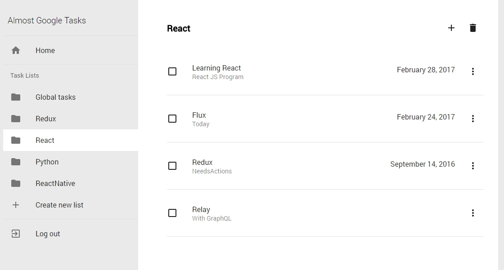

## React Google Tasks App



Created by `create-react-app`. Deployed by  `create-react-app-buildpack`  
Based on `React`, `React Router`, `Flux`, `Material-UI` and `Google Tasks API`

To getting started, run following code in your console: 

```
git clone https://github.com/KarafiziArtur/react-google-tasks.git
```
```
cd react-google-tasks
npm install
```
Then change your CLIENT_ID of Google Tasks API in `./src/config.js` and then run
```
npm start
```